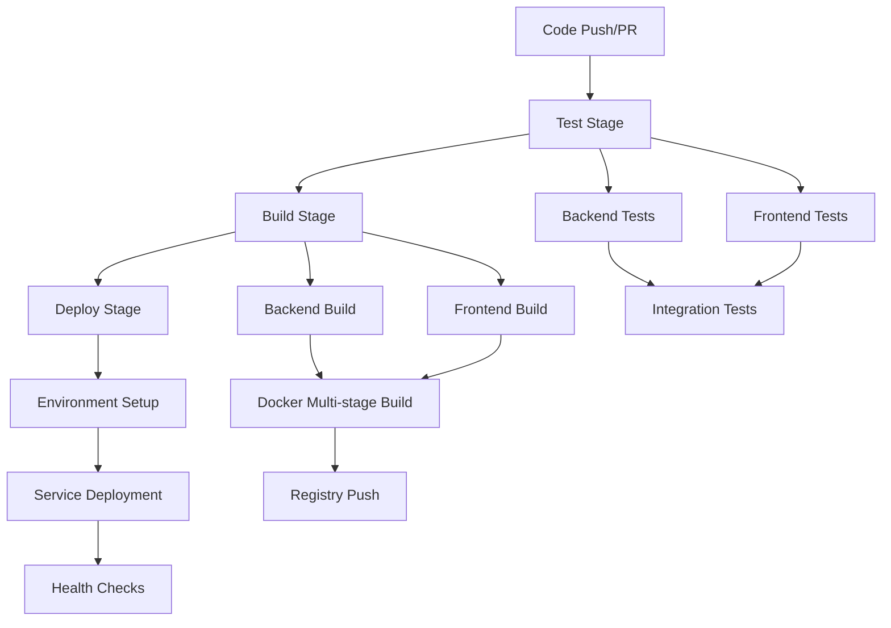

# Design Document

## Overview

The complete GitHub Actions CI/CD integration design addresses systematic failures across the entire pipeline by implementing a robust, multi-stage workflow that ensures reliable testing, building, containerization, and deployment. The design leverages GitHub Actions best practices, Docker multi-stage builds, and comprehensive error handling to create a production-ready CI/CD pipeline for the Procedural Mini Game Generator application.

## Architecture

### Pipeline Architecture

The CI/CD pipeline follows a dependency-based architecture with four main stages:



### Job Dependencies and Orchestration

- **Test Jobs**: Run in parallel for maximum efficiency
- **Build Jobs**: Execute only after all tests pass
- **Deploy Jobs**: Trigger only on successful builds from main branch
- **Conditional Execution**: Failed jobs skip dependent stages appropriately

## Components and Interfaces

### 1. GitHub Actions Workflow Configuration

#### Main Workflow File (`.github/workflows/ci-cd.yml`)

```yaml
name: Complete CI/CD Pipeline

on:
  push:
    branches: [ main, develop ]
  pull_request:
    branches: [ main ]

env:
  REGISTRY: ghcr.io
  IMAGE_NAME_BACKEND: ${{ github.repository }}/backend
  IMAGE_NAME_FRONTEND: ${{ github.repository }}/frontend

jobs:
  test-backend:
    name: Backend Tests
    runs-on: ubuntu-latest
    steps:
      - uses: actions/checkout@v4
      - name: Setup .NET
        uses: actions/setup-dotnet@v4
        with:
          dotnet-version: '8.0.x'
      - name: Cache NuGet packages
        uses: actions/cache@v4
        with:
          path: ~/.nuget/packages
          key: ${{ runner.os }}-nuget-${{ hashFiles('**/*.csproj') }}
      - name: Restore dependencies
        run: dotnet restore
      - name: Build
        run: dotnet build --no-restore --configuration Release
      - name: Test
        run: dotnet test --no-build --configuration Release --verbosity normal --logger trx --results-directory TestResults
      - name: Upload test results
        uses: actions/upload-artifact@v4
        if: always()
        with:
          name: backend-test-results
          path: TestResults/*.trx

  test-frontend:
    name: Frontend Tests
    runs-on: ubuntu-latest
    steps:
      - uses: actions/checkout@v4
      - name: Setup Node.js
        uses: actions/setup-node@v4
        with:
          node-version: '18'
          cache: 'npm'
          cache-dependency-path: frontend/package-lock.json
      - name: Install dependencies
        run: npm ci
        working-directory: frontend
      - name: Lint
        run: npm run lint
        working-directory: frontend
      - name: Type check
        run: npm run type-check
        working-directory: frontend
      - name: Test
        run: npm run test:ci
        working-directory: frontend
      - name: Upload coverage
        uses: actions/upload-artifact@v4
        with:
          name: frontend-coverage
          path: frontend/coverage

  build-and-push:
    name: Build and Push Images
    runs-on: ubuntu-latest
    needs: [test-backend, test-frontend]
    permissions:
      contents: read
      packages: write
    steps:
      - uses: actions/checkout@v4
      - name: Log in to Container Registry
        uses: docker/login-action@v3
        with:
          registry: ${{ env.REGISTRY }}
          username: ${{ github.actor }}
          password: ${{ secrets.GITHUB_TOKEN }}
      - name: Set up Docker Buildx
        uses: docker/setup-buildx-action@v3
      - name: Extract metadata (backend)
        id: meta-backend
        uses: docker/metadata-action@v5
        with:
          images: ${{ env.REGISTRY }}/${{ env.IMAGE_NAME_BACKEND }}
      - name: Extract metadata (frontend)
        id: meta-frontend
        uses: docker/metadata-action@v5
        with:
          images: ${{ env.REGISTRY }}/${{ env.IMAGE_NAME_FRONTEND }}
      - name: Build and push backend image
        uses: docker/build-push-action@v5
        with:
          context: ./backend
          push: true
          tags: ${{ steps.meta-backend.outputs.tags }}
          labels: ${{ steps.meta-backend.outputs.labels }}
          cache-from: type=gha
          cache-to: type=gha,mode=max
      - name: Build and push frontend image
        uses: docker/build-push-action@v5
        with:
          context: ./frontend
          push: true
          tags: ${{ steps.meta-frontend.outputs.tags }}
          labels: ${{ steps.meta-frontend.outputs.labels }}
          cache-from: type=gha
          cache-to: type=gha,mode=max

  deploy:
    name: Deploy Application
    runs-on: ubuntu-latest
    needs: build-and-push
    if: github.ref == 'refs/heads/main'
    environment: production
    steps:
      - uses: actions/checkout@v4
      - name: Deploy to production
        run: |
          echo "Deploying application..."
          # Deployment logic here
```

### 2. Docker Multi-Stage Build Configuration

#### Backend Dockerfile

```dockerfile
# syntax=docker/dockerfile:1

# Build stage
FROM mcr.microsoft.com/dotnet/sdk:8.0-alpine AS build
WORKDIR /src

# Copy project files and restore dependencies
COPY ["ProceduralMiniGameGenerator.WebAPI/ProceduralMiniGameGenerator.WebAPI.csproj", "ProceduralMiniGameGenerator.WebAPI/"]
COPY ["ProceduralMiniGameGenerator.WebAPI.Tests/ProceduralMiniGameGenerator.WebAPI.Tests.csproj", "ProceduralMiniGameGenerator.WebAPI.Tests/"]
RUN dotnet restore "ProceduralMiniGameGenerator.WebAPI/ProceduralMiniGameGenerator.WebAPI.csproj"

# Copy source code and build
COPY . .
WORKDIR "/src/ProceduralMiniGameGenerator.WebAPI"
RUN dotnet build "ProceduralMiniGameGenerator.WebAPI.csproj" -c Release -o /app/build

# Test stage
FROM build AS test
WORKDIR /src
RUN dotnet test "ProceduralMiniGameGenerator.WebAPI.Tests/ProceduralMiniGameGenerator.WebAPI.Tests.csproj" -c Release --logger trx --results-directory /testresults

# Publish stage
FROM build AS publish
RUN dotnet publish "ProceduralMiniGameGenerator.WebAPI.csproj" -c Release -o /app/publish /p:UseAppHost=false

# Final runtime stage
FROM mcr.microsoft.com/dotnet/aspnet:8.0-alpine AS final
WORKDIR /app
RUN addgroup -g 1001 -S appgroup && \
    adduser -S appuser -u 1001 -G appgroup
COPY --from=publish /app/publish .
RUN chown -R appuser:appgroup /app
USER appuser
EXPOSE 8080
ENTRYPOINT ["dotnet", "ProceduralMiniGameGenerator.WebAPI.dll"]
```

#### Frontend Dockerfile

```dockerfile
# syntax=docker/dockerfile:1

# Build stage
FROM node:18-alpine AS build
WORKDIR /app

# Copy package files and install dependencies
COPY package*.json ./
RUN npm ci --only=production && npm cache clean --force

# Copy source and build
COPY . .
RUN npm run build

# Test stage
FROM build AS test
RUN npm ci
RUN npm run lint
RUN npm run type-check
RUN npm run test:ci

# Production stage
FROM nginx:alpine AS final
COPY --from=build /app/dist /usr/share/nginx/html
COPY nginx.conf /etc/nginx/nginx.conf
RUN addgroup -g 1001 -S appgroup && \
    adduser -S appuser -u 1001 -G appgroup && \
    chown -R appuser:appgroup /usr/share/nginx/html
USER appuser
EXPOSE 80
CMD ["nginx", "-g", "daemon off;"]
```

### 3. Problem Matchers and Error Reporting

#### .NET Problem Matcher (`.github/problem-matchers/dotnet.json`)

```json
{
  "problemMatcher": [
    {
      "owner": "dotnet-build",
      "pattern": [
        {
          "regexp": "^\\s*(.+)\\((\\d+),(\\d+)\\): (error|warning) ([^:]+): (.*) \\[(.+)\\]$",
          "file": 1,
          "line": 2,
          "column": 3,
          "severity": 4,
          "code": 5,
          "message": 6,
          "fromPath": 7
        }
      ]
    },
    {
      "owner": "dotnet-test",
      "pattern": [
        {
          "regexp": "^\\s*Failed\\s+(.+)\\s*$",
          "message": 1
        },
        {
          "regexp": "^\\s*Error Message:\\s*(.*)$",
          "message": 1,
          "loop": true
        }
      ]
    }
  ]
}
```

#### ESLint Problem Matcher (`.github/problem-matchers/eslint.json`)

```json
{
  "problemMatcher": [
    {
      "owner": "eslint-stylish",
      "pattern": [
        {
          "regexp": "^([^\\s].*)$",
          "file": 1
        },
        {
          "regexp": "^\\s+(\\d+):(\\d+)\\s+(error|warning|info)\\s+(.*)\\s\\s+(.*)$",
          "line": 1,
          "column": 2,
          "severity": 3,
          "message": 4,
          "code": 5,
          "loop": true
        }
      ]
    }
  ]
}
```

### 4. Caching Strategy

#### Build Cache Configuration

- **NuGet Package Cache**: Cache .NET dependencies using `~/.nuget/packages`
- **npm Cache**: Leverage built-in npm caching with `actions/setup-node`
- **Docker Layer Cache**: Use GitHub Actions cache for Docker builds
- **Test Result Cache**: Cache test artifacts for faster feedback

#### Cache Keys Strategy

```yaml
# .NET Cache Key
key: ${{ runner.os }}-nuget-${{ hashFiles('**/*.csproj') }}

# Node.js Cache Key  
key: ${{ runner.os }}-node-${{ hashFiles('**/package-lock.json') }}

# Docker Cache
cache-from: type=gha
cache-to: type=gha,mode=max
```

## Data Models

### 1. Pipeline State Model

```typescript
interface PipelineState {
  id: string;
  status: 'pending' | 'running' | 'success' | 'failure' | 'cancelled';
  stages: StageState[];
  startTime: Date;
  endTime?: Date;
  triggeredBy: string;
  branch: string;
  commit: string;
}

interface StageState {
  name: string;
  status: 'pending' | 'running' | 'success' | 'failure' | 'skipped';
  jobs: JobState[];
  startTime?: Date;
  endTime?: Date;
}

interface JobState {
  name: string;
  status: 'pending' | 'running' | 'success' | 'failure';
  steps: StepState[];
  runner: string;
  startTime?: Date;
  endTime?: Date;
  artifacts: Artifact[];
}
```

### 2. Test Results Model

```typescript
interface TestResults {
  framework: 'dotnet' | 'jest' | 'cypress';
  totalTests: number;
  passedTests: number;
  failedTests: number;
  skippedTests: number;
  duration: number;
  coverage?: CoverageReport;
  failures: TestFailure[];
}

interface TestFailure {
  testName: string;
  className?: string;
  errorMessage: string;
  stackTrace: string;
  file: string;
  line: number;
}
```

### 3. Build Artifacts Model

```typescript
interface BuildArtifact {
  name: string;
  type: 'docker-image' | 'test-results' | 'coverage-report' | 'build-logs';
  location: string;
  size: number;
  checksum: string;
  createdAt: Date;
  metadata: Record<string, any>;
}
```

## Error Handling

### 1. Failure Recovery Strategies

#### Test Failures
- **Retry Logic**: Implement automatic retry for flaky tests
- **Parallel Execution**: Run tests in parallel to reduce feedback time
- **Fail Fast**: Stop execution on critical test failures
- **Detailed Reporting**: Provide comprehensive test failure information

#### Build Failures
- **Layer Caching**: Use Docker layer caching to speed up rebuilds
- **Incremental Builds**: Only rebuild changed components
- **Dependency Resolution**: Clear dependency caches on resolution failures
- **Multi-stage Rollback**: Ability to rollback to previous successful build

#### Deployment Failures
- **Health Checks**: Verify service health before marking deployment successful
- **Rollback Mechanism**: Automatic rollback on deployment failure
- **Blue-Green Deployment**: Zero-downtime deployment strategy
- **Monitoring Integration**: Real-time monitoring of deployed services

### 2. Error Notification System

```yaml
# Notification Configuration
notifications:
  slack:
    webhook: ${{ secrets.SLACK_WEBHOOK }}
    channels:
      - "#ci-cd-alerts"
      - "#dev-team"
  email:
    recipients:
      - "dev-team@company.com"
  github:
    create_issue: true
    assignees:
      - "devops-team"
```

### 3. Diagnostic Information Collection

#### Build Context Information
- Git commit SHA and branch information
- Environment variables and configuration
- Dependency versions and lock files
- System resource usage during builds

#### Error Context Capture
- Full stack traces and error messages
- Build logs with timestamps
- Environment state at failure time
- Previous successful build comparison

## Testing Strategy

### 1. Test Execution Strategy

#### Backend Testing
- **Unit Tests**: xUnit framework with comprehensive coverage
- **Integration Tests**: Test API endpoints and database interactions
- **Performance Tests**: Load testing for critical endpoints
- **Security Tests**: Vulnerability scanning and penetration testing

#### Frontend Testing
- **Unit Tests**: Jest for component and utility testing
- **Integration Tests**: React Testing Library for component integration
- **E2E Tests**: Cypress for full user journey testing
- **Accessibility Tests**: Automated accessibility compliance testing

#### Infrastructure Testing
- **Container Tests**: Verify Docker image functionality
- **Security Scanning**: Container vulnerability assessment
- **Configuration Tests**: Validate deployment configurations
- **Smoke Tests**: Basic functionality verification post-deployment

### 2. Test Data Management

#### Test Database Strategy
- **In-Memory Database**: For unit and integration tests
- **Test Fixtures**: Consistent test data across environments
- **Data Seeding**: Automated test data generation
- **Cleanup Procedures**: Ensure test isolation and cleanup

#### Mock and Stub Strategy
- **External Service Mocking**: Mock third-party API dependencies
- **Database Mocking**: Use in-memory alternatives for testing
- **File System Mocking**: Mock file operations for testing
- **Network Mocking**: Simulate network conditions and failures

### 3. Test Reporting and Analytics

#### Coverage Reporting
- **Code Coverage**: Minimum 80% coverage requirement
- **Branch Coverage**: Ensure all code paths are tested
- **Integration Coverage**: Measure end-to-end test coverage
- **Trend Analysis**: Track coverage trends over time

#### Performance Metrics
- **Test Execution Time**: Monitor and optimize test performance
- **Build Duration**: Track build time trends and optimization opportunities
- **Resource Usage**: Monitor CPU, memory, and disk usage during tests
- **Flaky Test Detection**: Identify and address unreliable tests

## Security Considerations

### 1. Secret Management

#### GitHub Secrets Configuration
```yaml
secrets:
  DOCKER_REGISTRY_TOKEN: ${{ secrets.DOCKER_REGISTRY_TOKEN }}
  DEPLOYMENT_KEY: ${{ secrets.DEPLOYMENT_KEY }}
  DATABASE_CONNECTION: ${{ secrets.DATABASE_CONNECTION }}
  API_KEYS: ${{ secrets.API_KEYS }}
```

#### Secret Rotation Strategy
- **Automated Rotation**: Regular secret rotation schedule
- **Access Auditing**: Track secret access and usage
- **Least Privilege**: Minimal required permissions for each secret
- **Environment Isolation**: Separate secrets for different environments

### 2. Container Security

#### Image Security Scanning
```yaml
- name: Run Trivy vulnerability scanner
  uses: aquasecurity/trivy-action@master
  with:
    image-ref: ${{ env.REGISTRY }}/${{ env.IMAGE_NAME }}:${{ github.sha }}
    format: 'sarif'
    output: 'trivy-results.sarif'
```

#### Security Best Practices
- **Non-root User**: Run containers as non-privileged users
- **Minimal Base Images**: Use distroless or alpine base images
- **Regular Updates**: Keep base images and dependencies updated
- **Security Policies**: Implement pod security policies and network policies

### 3. Access Control

#### Repository Permissions
- **Branch Protection**: Require PR reviews and status checks
- **Required Reviews**: Minimum reviewer requirements
- **Dismiss Stale Reviews**: Automatically dismiss outdated reviews
- **Restrict Push**: Prevent direct pushes to protected branches

#### Deployment Permissions
- **Environment Protection**: Require manual approval for production deployments
- **Reviewer Requirements**: Designated reviewers for deployment approval
- **Time-based Restrictions**: Deployment windows and restrictions
- **Audit Logging**: Comprehensive audit trail for all deployments

## Performance Optimization

### 1. Build Performance

#### Parallel Execution
- **Job Parallelization**: Run independent jobs concurrently
- **Test Parallelization**: Execute tests in parallel where possible
- **Build Optimization**: Optimize Docker builds with multi-stage caching
- **Resource Allocation**: Appropriate runner sizing for workloads

#### Caching Strategy
- **Dependency Caching**: Cache package manager dependencies
- **Build Artifact Caching**: Cache intermediate build artifacts
- **Docker Layer Caching**: Leverage Docker layer caching
- **Test Result Caching**: Cache test results for unchanged code

### 2. Resource Management

#### Runner Optimization
```yaml
runs-on: ubuntu-latest-4-cores  # Use appropriate runner size
```

#### Memory and CPU Allocation
- **Build Resource Limits**: Set appropriate resource limits
- **Parallel Job Limits**: Control concurrent job execution
- **Timeout Configuration**: Set reasonable timeouts for all jobs
- **Resource Monitoring**: Monitor resource usage and optimize

### 3. Network Optimization

#### Registry Optimization
- **Image Layer Optimization**: Minimize Docker image layers
- **Registry Caching**: Use registry caching for faster pulls
- **Compression**: Enable compression for artifact transfers
- **CDN Integration**: Use CDN for artifact distribution

## Monitoring and Observability

### 1. Pipeline Monitoring

#### Metrics Collection
```yaml
- name: Collect build metrics
  run: |
    echo "build_duration_seconds{job=\"${{ github.job }}\"} ${{ steps.build.outputs.duration }}" >> metrics.txt
    echo "test_count{status=\"passed\"} ${{ steps.test.outputs.passed }}" >> metrics.txt
    echo "test_count{status=\"failed\"} ${{ steps.test.outputs.failed }}" >> metrics.txt
```

#### Dashboard Integration
- **GitHub Actions Dashboard**: Built-in workflow monitoring
- **Custom Dashboards**: Grafana dashboards for detailed metrics
- **Alert Configuration**: Proactive alerting for pipeline failures
- **Trend Analysis**: Historical analysis of pipeline performance

### 2. Application Monitoring

#### Health Checks
```yaml
- name: Health check
  run: |
    curl -f http://localhost:8080/health || exit 1
    curl -f http://localhost:3000/health || exit 1
```

#### Performance Monitoring
- **Response Time Monitoring**: Track API response times
- **Error Rate Monitoring**: Monitor application error rates
- **Resource Usage**: Monitor CPU, memory, and disk usage
- **User Experience**: Monitor frontend performance metrics

### 3. Alerting Strategy

#### Alert Configuration
```yaml
alerts:
  pipeline_failure:
    condition: "status == 'failure'"
    severity: "high"
    channels: ["slack", "email"]
  
  build_duration:
    condition: "duration > 30m"
    severity: "medium"
    channels: ["slack"]
  
  test_failure_rate:
    condition: "failure_rate > 10%"
    severity: "high"
    channels: ["slack", "email", "pagerduty"]
```

This comprehensive design provides a robust foundation for implementing a complete GitHub Actions CI/CD pipeline that addresses all the requirements identified in the requirements document, with proper error handling, security considerations, and performance optimization.