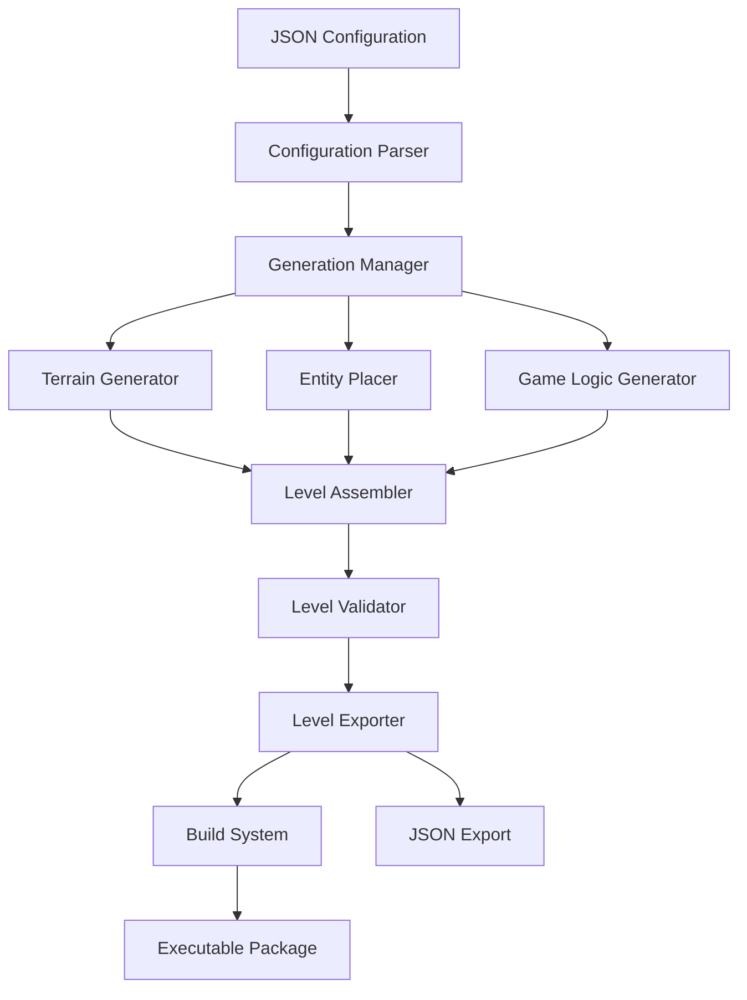

# Design Document: Procedural Mini-game Generator

## Overview

The Procedural Mini-game Generator is a system designed to automatically create playable 2D levels for mini-games based on JSON configuration files. The system will generate unique maps with terrain, enemies, items, and other game elements, and package them into ready-to-test executables. This design document outlines the architecture, components, data models, and implementation strategies for the system.

## Architecture

The system follows a modular architecture with clear separation of concerns:



### Core Components

1. **Configuration System**: Handles reading, validating, and processing JSON configuration files.
2. **Generation Manager**: Orchestrates the generation process and manages the different generation modules.
3. **Terrain Generator**: Creates the tile-based map structure using various algorithms.
4. **Entity Placer**: Positions enemies, items, and other dynamic elements in valid locations.
5. **Level Assembler**: Combines terrain and entities into a complete level.
6. **Level Validator**: Ensures generated levels are playable and meet quality standards.
7. **Editor Integration**: Provides UI elements and commands for triggering generation from the editor.
8. **Build System**: Automates the compilation of executables with generated content.

## Components and Interfaces

### Configuration Parser

```csharp
public interface IConfigurationParser
{
    GenerationConfig ParseConfig(string jsonPath);
    bool ValidateConfig(GenerationConfig config, out List<string> errors);
    GenerationConfig GetDefaultConfig();
}
```

The Configuration Parser is responsible for:
- Reading JSON files and converting them to configuration objects
- Validating configuration parameters
- Providing default values for missing parameters
- Reporting errors in configuration files

### Generation Manager

```csharp
public interface IGenerationManager
{
    Level GenerateLevel(GenerationConfig config);
    void SetSeed(int seed);
    void RegisterGenerationAlgorithm(string name, ITerrainGenerator generator);
    void RegisterEntityPlacer(string name, IEntityPlacer placer);
}
```

The Generation Manager:
- Coordinates the generation process
- Manages random seed values for reproducible generation
- Delegates to specific algorithms based on configuration
- Provides extension points for custom generation algorithms

### Terrain Generator

```csharp
public interface ITerrainGenerator
{
    TileMap GenerateTerrain(GenerationConfig config, int seed);
    bool SupportsParameters(Dictionary<string, object> parameters);
    string GetAlgorithmName();
}
```

The system will include multiple terrain generation algorithms:
1. **Perlin Noise Generator**: Creates natural-looking terrain with smooth transitions
2. **Cellular Automata Generator**: Produces cave-like structures and organic patterns
3. **Maze Generator**: Creates maze-like structures with paths and walls
4. **Room-based Generator**: Creates interconnected rooms and corridors

### Entity Placer

```csharp
public interface IEntityPlacer
{
    List<Entity> PlaceEntities(TileMap terrain, GenerationConfig config, int seed);
    bool IsValidPosition(Vector2 position, TileMap terrain, List<Entity> existingEntities);
}
```

The Entity Placer:
- Places enemies, items, and other dynamic elements
- Ensures entities are placed in valid positions
- Respects configuration parameters for entity counts and types
- Avoids placing entities in unreachable areas

### Level Assembler

```csharp
public interface ILevelAssembler
{
    Level AssembleLevel(TileMap terrain, List<Entity> entities, GenerationConfig config);
    void ApplyVisualTheme(Level level, VisualTheme theme);
}
```

The Level Assembler:
- Combines terrain and entities into a complete level
- Applies visual themes and styles
- Ensures consistency between different level elements
- Prepares the level for validation and export

### Level Validator

```csharp
public interface ILevelValidator
{
    bool ValidateLevel(Level level, out List<string> issues);
    bool IsPlayable(Level level);
    float EvaluateQuality(Level level);
}
```

The Level Validator:
- Checks if the level is navigable and playable
- Evaluates level quality based on predefined metrics
- Identifies potential issues or problems
- Provides feedback for level improvement

### Editor Integration

```csharp
public class EditorIntegration
{
    public void RegisterEditorCommands();
    public void ShowGenerationWindow();
    public void DisplayGeneratedLevel(Level level);
    public void ReportErrors(List<string> errors);
}
```

The Editor Integration:
- Provides UI elements for triggering generation
- Allows selection of configuration files
- Displays generated levels in the editor
- Reports errors and warnings

### Build System

```csharp
public interface IBuildSystem
{
    bool BuildExecutable(Level level, string outputPath);
    void ConfigureBuildSettings(BuildSettings settings);
    string GetBuildLog();
}
```

The Build System:
- Automates the compilation process
- Packages generated content into executables
- Provides build logs and error reporting
- Supports different build configurations

### AI Integration

```csharp
public interface IAIContentGenerator
{
    string GenerateItemDescription(ItemType type, VisualTheme theme);
    string[] GenerateNPCDialogue(NPCType type, int lineCount);
    string GenerateLevelName(Level level, VisualTheme theme);
}
```

The AI Integration:
- Connects to external AI services
- Generates descriptive text for items
- Creates NPC dialogue
- Generates level names and descriptions
- Falls back to templates when AI is unavailable

## Data Models

### GenerationConfig

```csharp
public class GenerationConfig
{
    public int Width { get; set; }
    public int Height { get; set; }
    public int Seed { get; set; }
    public string GenerationAlgorithm { get; set; }
    public Dictionary<string, object> AlgorithmParameters { get; set; }
    public List<EntityConfig> Entities { get; set; }
    public VisualThemeConfig VisualTheme { get; set; }
    public GameplayConfig Gameplay { get; set; }
}
```

### TileMap

```csharp
public class TileMap
{
    public int Width { get; }
    public int Height { get; }
    public TileType[,] Tiles { get; }
    
    public TileType GetTile(int x, int y);
    public void SetTile(int x, int y, TileType type);
    public bool IsWalkable(int x, int y);
}
```

### Entity

```csharp
public abstract class Entity
{
    public Vector2 Position { get; set; }
    public EntityType Type { get; }
    public Dictionary<string, object> Properties { get; }
    
    public abstract bool CanPlaceAt(Vector2 position, TileMap terrain, List<Entity> entities);
}
```

### Level

```csharp
public class Level
{
    public TileMap Terrain { get; }
    public List<Entity> Entities { get; }
    public string Name { get; set; }
    public Dictionary<string, object> Metadata { get; }
    
    public string ExportToJson();
    public static Level ImportFromJson(string json);
}
```

### VisualTheme

```csharp
public class VisualTheme
{
    public string Name { get; }
    public Dictionary<TileType, string> TileSprites { get; }
    public Dictionary<EntityType, string> EntitySprites { get; }
    public ColorPalette Colors { get; }
}
```

## Error Handling

The system implements a comprehensive error handling strategy:

1. **Validation Errors**: Configuration errors are detected early and reported with specific messages.
2. **Generation Errors**: Issues during generation are logged and reported to the user.
3. **Build Errors**: Problems during the build process are captured and displayed with troubleshooting guidance.
4. **Runtime Validation**: Generated levels are validated for playability before being finalized.

Error messages will be:
- Specific and actionable
- Categorized by severity (warning, error, critical)
- Displayed in the appropriate context (editor UI, logs, console)
- Accompanied by suggested solutions when possible

## Testing Strategy

The testing strategy includes:

1. **Unit Tests**:
   - Test individual components in isolation
   - Verify algorithm correctness
   - Validate configuration parsing
   - Test entity placement logic

2. **Integration Tests**:
   - Test interaction between components
   - Verify end-to-end generation process
   - Test editor integration
   - Validate build system

3. **Playability Tests**:
   - Automated tests for level navigability
   - Checks for unreachable areas or items
   - Verification of enemy placement logic
   - Evaluation of level quality metrics

4. **Performance Tests**:
   - Measure generation time for different configurations
   - Test memory usage during generation
   - Evaluate build process performance
   - Benchmark executable performance

## Implementation Considerations

### Extensibility

The system is designed to be extensible:
- Plugin architecture for generation algorithms
- Custom entity types and behaviors
- Extensible visual theming system
- Support for custom validation rules

### Performance

Performance considerations include:
- Optimized generation algorithms for large maps
- Parallel processing where applicable
- Efficient data structures for tile and entity management
- Caching of intermediate results during generation

### Usability

Usability features include:
- Intuitive editor interface
- Clear documentation and examples
- Helpful error messages and warnings
- Visual preview of generated content

### Integration

The system integrates with:
- Game engine editor
- Build pipeline
- Version control systems
- External AI services (optional)

## Future Enhancements

Potential future enhancements include:
1. Machine learning-based level evaluation and improvement
2. Support for 3D level generation
3. Collaborative generation with multiple users
4. Cloud-based generation service
5. Advanced gameplay mechanics generation
6. Integration with asset marketplaces for visual themes