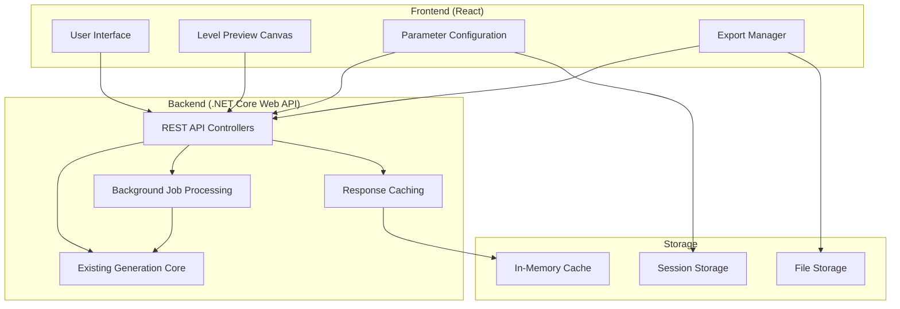

# Design Document

## Overview

The Web Level Editor transforms the existing C# procedural mini-game generator into a comprehensive web application. The design follows a modern web architecture with a .NET Core Web API backend serving the existing generation logic and a React-based frontend providing an intuitive visual interface.

The system maintains the robust generation engine while adding web accessibility, real-time visualization, collaborative features, and multiple export formats. The architecture ensures scalability, maintainability, and seamless integration with existing game development workflows.

## Architecture

### High-Level Architecture



### Technology Stack

**Frontend:**
- React 18 with TypeScript
- Canvas API for level visualization
- Material-UI for component library
- Axios for API communication
- React Query for state management and caching

**Backend:**
- .NET Core 8 Web API
- Existing C# generation engine (minimal modifications)
- SignalR for real-time updates
- Hangfire for background job processing
- Memory caching for performance

**Deployment:**
- Docker containers for both frontend and backend
- Azure App Service or similar cloud hosting
- CDN for static assets

## Components and Interfaces

### Frontend Components

#### 1. Main Application Shell
```typescript
interface AppShellProps {
  children: React.ReactNode;
}

interface AppState {
  currentProject: ProjectConfig | null;
  isGenerating: boolean;
  notifications: Notification[];
}
```

#### 2. Parameter Configuration Panel
```typescript
interface ConfigurationPanelProps {
  config: GenerationConfig;
  onChange: (config: GenerationConfig) => void;
  onValidate: (config: GenerationConfig) => ValidationResult;
}

interface ConfigurationState {
  activeTab: 'terrain' | 'entities' | 'visual' | 'gameplay';
  presets: ConfigPreset[];
  validationErrors: ValidationError[];
}
```

#### 3. Level Preview Canvas
```typescript
interface LevelPreviewProps {
  level: Level | null;
  isLoading: boolean;
  onTileClick: (x: number, y: number) => void;
  onEntityDrag: (entityId: string, newPosition: Position) => void;
}

interface CanvasRenderer {
  renderTerrain(terrain: TileMap): void;
  renderEntities(entities: Entity[]): void;
  renderGrid(showGrid: boolean): void;
  handleInteraction(event: MouseEvent | TouchEvent): void;
}
```

#### 4. Export Manager
```typescript
interface ExportManagerProps {
  level: Level;
  availableFormats: ExportFormat[];
  onExport: (format: ExportFormat, options: ExportOptions) => void;
}

interface ExportFormat {
  id: string;
  name: string;
  description: string;
  fileExtension: string;
  supportsCustomization: boolean;
}
```

### Core Services

#### 1. Logging Service
```csharp
public interface ILoggerService
{
    Task LogAsync(LogLevel level, string message, object? context = null);
    Task LogGenerationAsync(string configId, string step, TimeSpan duration, object? metadata = null);
    Task LogErrorAsync(Exception exception, string context, object? additionalData = null);
    Task LogPerformanceAsync(string operation, TimeSpan duration, object? metrics = null);
}

public class LoggerService : ILoggerService
{
    private readonly ILogger<LoggerService> _logger;
    private readonly IConfiguration _configuration;
    
    public async Task LogAsync(LogLevel level, string message, object? context = null)
    {
        // Structured logging with context
        _logger.Log(level, "{Message} {@Context}", message, context);
    }
}
```

#### 2. Plugin Loader System
```csharp
public interface IPluginLoader
{
    Task<IEnumerable<T>> LoadPluginsAsync<T>() where T : class;
    Task RegisterPluginAsync<T>(T plugin) where T : class;
    Task<T?> GetPluginAsync<T>(string name) where T : class;
}

public class PluginLoader : IPluginLoader
{
    private readonly Dictionary<Type, Dictionary<string, object>> _plugins = new();
    private readonly ILoggerService _logger;
    
    public async Task<IEnumerable<T>> LoadPluginsAsync<T>() where T : class
    {
        // Load terrain generators, entity placers, and other extensible components
        var pluginType = typeof(T);
        
        if (pluginType == typeof(ITerrainGenerator))
        {
            return await LoadTerrainGenerators() as IEnumerable<T>;
        }
        else if (pluginType == typeof(IEntityPlacer))
        {
            return await LoadEntityPlacers() as IEnumerable<T>;
        }
        
        return Enumerable.Empty<T>();
    }
    
    private async Task<IEnumerable<ITerrainGenerator>> LoadTerrainGenerators()
    {
        // Register built-in generators
        var generators = new List<ITerrainGenerator>
        {
            new PerlinNoiseGenerator(),
            new CellularAutomataGenerator(),
            new MazeGenerator()
        };
        
        // Load external plugins from assemblies
        await LoadExternalPlugins<ITerrainGenerator>("TerrainGenerators");
        
        return generators;
    }
}
```

#### 3. Logging Middleware
```csharp
public class LoggingMiddleware
{
    private readonly RequestDelegate _next;
    private readonly ILoggerService _loggerService;
    
    public async Task InvokeAsync(HttpContext context)
    {
        var stopwatch = Stopwatch.StartNew();
        var requestId = Guid.NewGuid().ToString();
        
        context.Items["RequestId"] = requestId;
        
        try
        {
            await _loggerService.LogAsync(LogLevel.Information, 
                "Request started", 
                new { RequestId = requestId, Path = context.Request.Path });
            
            await _next(context);
            
            stopwatch.Stop();
            await _loggerService.LogPerformanceAsync(
                $"{context.Request.Method} {context.Request.Path}",
                stopwatch.Elapsed,
                new { RequestId = requestId, StatusCode = context.Response.StatusCode });
        }
        catch (Exception ex)
        {
            stopwatch.Stop();
            await _loggerService.LogErrorAsync(ex, "Request failed", 
                new { RequestId = requestId, Duration = stopwatch.Elapsed });
            throw;
        }
    }
}
```

### Backend API Controllers

#### 1. Generation Controller
```csharp
[ApiController]
[Route("api/[controller]")]
public class GenerationController : ControllerBase
{
    [HttpPost("generate")]
    public async Task<ActionResult<Level>> GenerateLevel([FromBody] GenerationConfig config);
    
    [HttpPost("generate-batch")]
    public async Task<ActionResult<string>> GenerateBatch([FromBody] BatchGenerationRequest request);
    
    [HttpGet("job/{jobId}/status")]
    public async Task<ActionResult<JobStatus>> GetJobStatus(string jobId);
    
    [HttpPost("validate-config")]
    public ActionResult<ValidationResult> ValidateConfiguration([FromBody] GenerationConfig config);
}
```

#### 2. Export Controller
```csharp
[ApiController]
[Route("api/[controller]")]
public class ExportController : ControllerBase
{
    [HttpPost("level")]
    public async Task<ActionResult<FileResult>> ExportLevel([FromBody] ExportRequest request);
    
    [HttpGet("formats")]
    public ActionResult<List<ExportFormat>> GetAvailableFormats();
    
    [HttpPost("batch-export")]
    public async Task<ActionResult<string>> ExportBatch([FromBody] BatchExportRequest request);
}
```

#### 3. Configuration Controller
```csharp
[ApiController]
[Route("api/[controller]")]
public class ConfigurationController : ControllerBase
{
    [HttpGet("presets")]
    public ActionResult<List<ConfigPreset>> GetPresets();
    
    [HttpPost("presets")]
    public async Task<ActionResult<ConfigPreset>> SavePreset([FromBody] ConfigPreset preset);
    
    [HttpGet("share/{shareId}")]
    public async Task<ActionResult<GenerationConfig>> GetSharedConfiguration(string shareId);
    
    [HttpPost("share")]
    public async Task<ActionResult<ShareResult>> CreateShareLink([FromBody] GenerationConfig config);
}
```

## Data Models

### Extended Models for Web Interface

```typescript
// Frontend TypeScript models
interface ProjectConfig {
  id: string;
  name: string;
  generationConfig: GenerationConfig;
  manualEdits: ManualEdit[];
  createdAt: Date;
  lastModified: Date;
}

interface ManualEdit {
  id: string;
  type: 'terrain' | 'entity';
  position: Position;
  originalValue: any;
  newValue: any;
  timestamp: Date;
}

interface ShareResult {
  shareId: string;
  shareUrl: string;
  expiresAt: Date;
}

interface BatchGenerationRequest {
  baseConfig: GenerationConfig;
  variations: ConfigVariation[];
  count: number;
}

interface ConfigVariation {
  parameter: string;
  values: any[];
}
```

```csharp
// Backend C# models (extensions to existing models)
public class WebGenerationRequest
{
    public GenerationConfig Config { get; set; }
    public bool IncludePreview { get; set; } = true;
    public string? SessionId { get; set; }
}

public class JobStatus
{
    public string JobId { get; set; }
    public string Status { get; set; } // "pending", "running", "completed", "failed"
    public int Progress { get; set; } // 0-100
    public string? ErrorMessage { get; set; }
    public object? Result { get; set; }
}

public class ExportRequest
{
    public Level Level { get; set; }
    public string Format { get; set; }
    public Dictionary<string, object> Options { get; set; }
}
```

## Error Handling

### Frontend Error Handling
```typescript
interface ErrorBoundaryState {
  hasError: boolean;
  error: Error | null;
  errorInfo: ErrorInfo | null;
}

class ApiErrorHandler {
  static handleGenerationError(error: AxiosError): UserFriendlyError {
    if (error.response?.status === 400) {
      return new UserFriendlyError(
        "Configuration Error",
        "Please check your generation parameters and try again.",
        error.response.data
      );
    }
    // Handle other error types...
  }
}
```

### Backend Error Handling
```csharp
public class GlobalExceptionMiddleware
{
    public async Task InvokeAsync(HttpContext context, RequestDelegate next)
    {
        try
        {
            await next(context);
        }
        catch (ValidationException ex)
        {
            await HandleValidationException(context, ex);
        }
        catch (GenerationException ex)
        {
            await HandleGenerationException(context, ex);
        }
        catch (Exception ex)
        {
            await HandleGenericException(context, ex);
        }
    }
}
```

## Testing Strategy

### Frontend Testing
1. **Unit Tests**: Jest + React Testing Library
   - Component rendering and interaction
   - Configuration validation logic
   - Canvas rendering functions
   - API service methods

2. **Integration Tests**: Cypress
   - End-to-end user workflows
   - API integration scenarios
   - Cross-browser compatibility
   - Mobile responsiveness

3. **Visual Regression Tests**: Percy or similar
   - Level preview rendering consistency
   - UI component visual stability

### Backend Testing
1. **Unit Tests**: xUnit (existing framework)
   - API controller methods
   - New web-specific services
   - Configuration sharing logic

2. **Integration Tests**: ASP.NET Core Test Host
   - Full API endpoint testing
   - Background job processing
   - File export functionality

3. **Performance Tests**: NBomber
   - Concurrent generation requests
   - Large level generation performance
   - Memory usage under load

### Testing Approach
- Maintain existing C# test suite
- Add web-specific test coverage
- Implement automated testing pipeline
- Include accessibility testing (axe-core)
- Test offline functionality and error recovery

## Performance Considerations

### Frontend Optimization
- Canvas rendering optimization with requestAnimationFrame
- Virtual scrolling for large level previews
- Debounced parameter updates to reduce API calls
- Progressive loading of level data
- Service worker for offline functionality

### Backend Optimization
- Response caching for common configurations
- Background job processing for large generations
- Connection pooling and async operations
- Memory-efficient level serialization
- Rate limiting to prevent abuse

### Caching Strategy
```csharp
public class GenerationCacheService
{
    public async Task<Level?> GetCachedLevel(string configHash)
    {
        return await _memoryCache.GetAsync<Level>($"level:{configHash}");
    }
    
    public async Task CacheLevel(string configHash, Level level, TimeSpan expiry)
    {
        await _memoryCache.SetAsync($"level:{configHash}", level, expiry);
    }
}
```

## Security Considerations

### API Security
- JWT authentication for user sessions
- Rate limiting per IP and user
- Input validation and sanitization
- CORS configuration for frontend domain
- File upload restrictions and scanning

### Data Protection
- No persistent storage of user data by default
- Optional user accounts with encrypted storage
- Secure sharing links with expiration
- Content Security Policy headers
- HTTPS enforcement

## Deployment Architecture

### Development Environment
```yaml
# docker-compose.yml
version: '3.8'
services:
  frontend:
    build: ./frontend
    ports:
      - "3000:3000"
    environment:
      - REACT_APP_API_URL=http://localhost:5000
  
  backend:
    build: ./backend
    ports:
      - "5000:80"
    environment:
      - ASPNETCORE_ENVIRONMENT=Development
```

### Production Deployment
- Frontend: Static hosting (Vercel, Netlify, or Azure Static Web Apps)
- Backend: Container hosting (Azure Container Apps, AWS ECS)
- CDN: Azure CDN or CloudFlare for global distribution
- Monitoring: Application Insights or similar APM solution

This design maintains the robustness of your existing generation engine while providing a modern, scalable web interface that can reach a much broader audience of game developers and level designers.