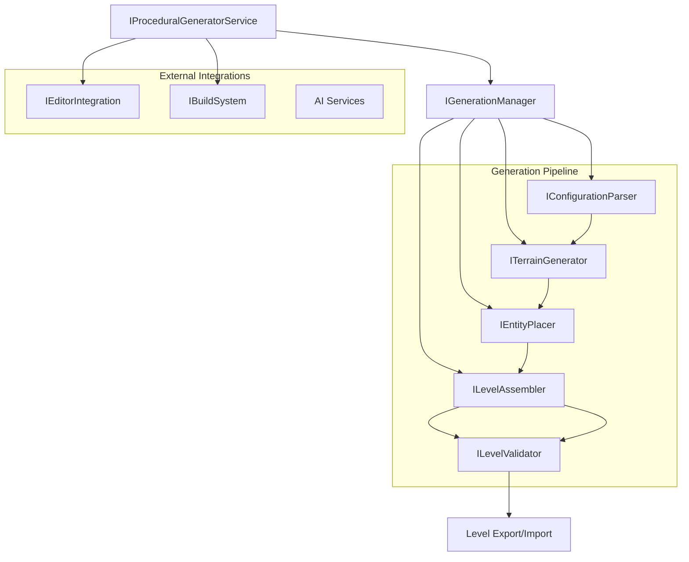

# Procedural Mini-game Generator - Developer Documentation

## Table of Contents
1. [System Architecture](#system-architecture)
2. [Core Components](#core-components)
3. [API Reference](#api-reference)
4. [Extension Points](#extension-points)
5. [Data Models](#data-models)
6. [Implementation Guidelines](#implementation-guidelines)
7. [Testing Framework](#testing-framework)
8. [Build System](#build-system)
9. [Performance Considerations](#performance-considerations)
10. [Contributing Guidelines](#contributing-guidelines)

## System Architecture

The Procedural Mini-game Generator follows a modular, plugin-based architecture with clear separation of concerns. The system is designed to be extensible, testable, and maintainable.

### High-Level Architecture



### Layer Architecture

1. **Service Layer**: `IProceduralGeneratorService` - Main entry point
2. **Management Layer**: `IGenerationManager` - Orchestrates generation process
3. **Generation Layer**: Terrain generators, entity placers, level assemblers
4. **Validation Layer**: Configuration and level validators
5. **Integration Layer**: Editor integration, build system, AI services
6. **Data Layer**: Models, configurations, and persistence

### Design Principles

- **Single Responsibility**: Each interface has a focused purpose
- **Open/Closed**: Extensible through plugins, closed for modification
- **Dependency Inversion**: Depend on abstractions, not concretions
- **Interface Segregation**: Small, focused interfaces
- **Composition over Inheritance**: Favor composition for flexibility

## Core Components

### IProceduralGeneratorService

The main service interface that provides the primary API for the generation system.

**Responsibilities:**
- Coordinate the entire generation process
- Provide high-level API for consumers
- Handle configuration validation
- Manage level export/import operations

**Key Methods:**
- `GenerateLevel()`: Main generation entry point
- `ValidateConfiguration()`: Validate configuration files
- `ExportLevel()` / `ImportLevel()`: Level persistence

### IGenerationManager

Orchestrates the generation pipeline and manages algorithm registration.

**Responsibilities:**
- Coordinate terrain generation, entity placement, and level assembly
- Manage random seed for reproducible generation
- Register and manage generation algorithms
- Validate generation configurations

**Key Methods:**
- `GenerateLevel()`: Execute the generation pipeline
- `SetSeed()`: Set random seed for reproducibility
- `RegisterGenerationAlgorithm()`: Add new terrain generators
- `RegisterEntityPlacer()`: Add new entity placement strategies

### ITerrainGenerator

Interface for terrain generation algorithms.

**Responsibilities:**
- Generate tile-based terrain from configuration
- Support algorithm-specific parameters
- Validate parameter compatibility
- Provide reproducible generation with seeds

**Built-in Implementations:**
- `PerlinNoiseGenerator`: Natural terrain using Perlin noise
- `CellularAutomataGenerator`: Cave-like structures
- `MazeGenerator`: Maze-like layouts
- `RoomBasedGenerator`: Room and corridor layouts

### IEntityPlacer

Interface for entity placement strategies.

**Responsibilities:**
- Place entities on generated terrain
- Validate placement positions
- Support different placement strategies
- Ensure entities are accessible

**Built-in Strategies:**
- `RandomPlacer`: Random valid positions
- `ClusteredPlacer`: Group entities together
- `SpreadPlacer`: Even distribution
- `WallProximityPlacer`: Near walls
- `CenterPlacer`: Near level center
- `CornerPlacer`: In corner areas

### ILevelValidator

Interface for validating generated levels.

**Responsibilities:**
- Ensure level playability
- Check entity accessibility
- Evaluate level quality
- Provide validation feedback

**Validation Checks:**
- Path existence from player to exit
- Entity reachability
- Terrain navigability
- Configuration compliance

## API Reference

### Core Service API

#### IProceduralGeneratorService

```csharp
public interface IProceduralGeneratorService
{
    // Level Generation
    Level GenerateLevel(string configPath);
    Level GenerateLevel(GenerationConfig config);
    
    // Configuration Management
    bool ValidateConfiguration(string configPath, out List<string> errors);
    List<string> GetAvailableAlgorithms();
    List<string> GetAvailablePlacementStrategies();
    
    // Level Persistence
    bool ExportLevel(Level level, string outputPath);
    Level ImportLevel(string jsonPath);
}
```

**Usage Example:**
```csharp
var service = new ProceduralGeneratorService();

// Generate from configuration file
var level = service.GenerateLevel("config.json");

// Validate configuration
if (service.ValidateConfiguration("config.json", out var errors))
{
    Console.WriteLine("Configuration is valid");
}
else
{
    Console.WriteLine($"Errors: {string.Join(", ", errors)}");
}

// Export generated level
service.ExportLevel(level, "generated_level.json");
```

#### IGenerationManager

```csharp
public interface IGenerationManager
{
    // Generation Control
    Level GenerateLevel(GenerationConfig config);
    void SetSeed(int seed);
    
    // Algorithm Management
    void RegisterGenerationAlgorithm(string name, ITerrainGenerator generator);
    void RegisterEntityPlacer(string name, IEntityPlacer placer);
    List<string> GetAvailableAlgorithms();
    List<string> GetAvailablePlacementStrategies();
    
    // Validation
    ValidationResult ValidateGenerationConfig(GenerationConfig config);
}
```

**Usage Example:**
```csharp
var manager = new GenerationManager();

// Register custom algorithm
manager.RegisterGenerationAlgorithm("custom", new CustomTerrainGenerator());

// Set seed for reproducible generation
manager.SetSeed(12345);

// Generate level
var config = new GenerationConfig { Width = 50, Height = 30 };
var level = manager.GenerateLevel(config);
```

### Generation Algorithms API

#### ITerrainGenerator

```csharp
public interface ITerrainGenerator
{
    // Core Generation
    TileMap GenerateTerrain(GenerationConfig config, int seed);
    
    // Algorithm Information
    string GetAlgorithmName();
    Dictionary<string, object> GetDefaultParameters();
    
    // Parameter Management
    bool SupportsParameters(Dictionary<string, object> parameters);
    List<string> ValidateParameters(Dictionary<string, object> parameters);
}
```

**Implementation Example:**
```csharp
public class CustomTerrainGenerator : ITerrainGenerator
{
    public string GetAlgorithmName() => "custom";
    
    public TileMap GenerateTerrain(GenerationConfig config, int seed)
    {
        var random = new Random(seed);
        var tileMap = new TileMap(config.Width, config.Height);
        
        // Custom generation logic here
        for (int x = 0; x < config.Width; x++)
        {
            for (int y = 0; y < config.Height; y++)
            {
                var tileType = random.NextDouble() > 0.3 ? TileType.Ground : TileType.Wall;
                tileMap.SetTile(x, y, tileType);
            }
        }
        
        return tileMap;
    }
    
    public Dictionary<string, object> GetDefaultParameters()
    {
        return new Dictionary<string, object>
        {
            ["density"] = 0.3,
            ["smoothing"] = true
        };
    }
    
    public bool SupportsParameters(Dictionary<string, object> parameters)
    {
        return parameters.ContainsKey("density") && parameters.ContainsKey("smoothing");
    }
    
    public List<string> ValidateParameters(Dictionary<string, object> parameters)
    {
        var errors = new List<string>();
        
        if (parameters.TryGetValue("density", out var density))
        {
            if (!(density is double d) || d < 0.0 || d > 1.0)
            {
                errors.Add("Density must be a number between 0.0 and 1.0");
            }
        }
        
        return errors;
    }
}
```

#### IEntityPlacer

```csharp
public interface IEntityPlacer
{
    // Entity Placement
    List<Entity> PlaceEntities(TileMap terrain, GenerationConfig config, int seed);
    
    // Position Validation
    bool IsValidPosition(Vector2 position, TileMap terrain, List<Entity> existingEntities);
}
```

**Implementation Example:**
```csharp
public class CustomEntityPlacer : IEntityPlacer
{
    public List<Entity> PlaceEntities(TileMap terrain, GenerationConfig config, int seed)
    {
        var random = new Random(seed);
        var entities = new List<Entity>();
        
        foreach (var entityConfig in config.Entities)
        {
            for (int i = 0; i < entityConfig.Count; i++)
            {
                var position = FindValidPosition(terrain, entities, random, entityConfig);
                if (position.HasValue)
                {
                    var entity = CreateEntity(entityConfig.Type, position.Value);
                    entities.Add(entity);
                }
            }
        }
        
        return entities;
    }
    
    public bool IsValidPosition(Vector2 position, TileMap terrain, List<Entity> existingEntities)
    {
        // Check if position is within bounds
        if (position.X < 0 || position.X >= terrain.Width || 
            position.Y < 0 || position.Y >= terrain.Height)
            return false;
        
        // Check if tile is walkable
        if (!terrain.IsWalkable((int)position.X, (int)position.Y))
            return false;
        
        // Check distance from existing entities
        foreach (var entity in existingEntities)
        {
            var distance = Vector2.Distance(position, entity.Position);
            if (distance < 2.0f) // Minimum distance
                return false;
        }
        
        return true;
    }
}
```

### Configuration API

#### IConfigurationParser

```csharp
public interface IConfigurationParser
{
    // Parsing
    GenerationConfig ParseConfig(string jsonPath);
    GenerationConfig ParseConfigFromString(string jsonContent);
    
    // Validation
    bool ValidateConfig(GenerationConfig config, out List<string> errors);
    
    // Defaults
    GenerationConfig GetDefaultConfig();
}
```

**Usage Example:**
```csharp
var parser = new ConfigurationParser();

// Parse from file
var config = parser.ParseConfig("level_config.json");

// Parse from string
var jsonString = File.ReadAllText("config.json");
var config2 = parser.ParseConfigFromString(jsonString);

// Validate configuration
if (parser.ValidateConfig(config, out var errors))
{
    Console.WriteLine("Configuration is valid");
}
else
{
    foreach (var error in errors)
    {
        Console.WriteLine($"Error: {error}");
    }
}
```

### Validation API

#### ILevelValidator

```csharp
public interface ILevelValidator
{
    // Validation
    bool ValidateLevel(Level level, out List<string> issues);
    bool IsPlayable(Level level);
    
    // Quality Assessment
    float EvaluateQuality(Level level);
}
```

**Usage Example:**
```csharp
var validator = new LevelValidator();

// Validate generated level
if (validator.ValidateLevel(level, out var issues))
{
    Console.WriteLine("Level is valid");
    
    // Check quality
    var quality = validator.EvaluateQuality(level);
    Console.WriteLine($"Level quality: {quality:P}");
}
else
{
    Console.WriteLine("Level validation failed:");
    foreach (var issue in issues)
    {
        Console.WriteLine($"- {issue}");
    }
}
```

### Integration APIs

#### IEditorIntegration

```csharp
public interface IEditorIntegration
{
    // Editor Commands
    void RegisterEditorCommands();
    void ShowGenerationWindow();
    
    // Level Display
    void DisplayGeneratedLevel(Level level);
    void ShowLevelPreview(Level level);
    
    // User Feedback
    void ReportErrors(List<string> errors);
    void ReportWarnings(List<string> warnings);
    void ReportValidationResult(ValidationResult validationResult);
    void DisplaySuccessMessage(string message);
    void DisplayInfoMessage(string message);
    
    // File Operations
    string SelectConfigurationFile();
}
```

#### IBuildSystem

```csharp
public interface IBuildSystem
{
    // Build Operations
    bool BuildExecutable(Level level, string outputPath);
    Task<bool> BuildExecutableAsync(Level level, string outputPath);
    BuildResult TriggerBuild(BuildConfiguration buildConfig);
    Task<BuildResult> TriggerBuildAsync(BuildConfiguration buildConfig);
    
    // Configuration
    void ConfigureBuildSettings(BuildSettings settings);
    BuildSettings GetBuildSettings();
    
    // Information
    string GetBuildLog();
    string[] GetAvailableTargets();
    bool IsReady();
    
    // Validation
    BuildValidationResult ValidateBuildConfiguration(BuildConfiguration buildConfig);
}
```

## Extension Points

### Creating Custom Terrain Generators

1. **Implement ITerrainGenerator**:
```csharp
public class WaveTerrainGenerator : ITerrainGenerator
{
    public string GetAlgorithmName() => "wave";
    
    public TileMap GenerateTerrain(GenerationConfig config, int seed)
    {
        // Implementation here
    }
    
    // Other required methods...
}
```

2. **Register with Generation Manager**:
```csharp
manager.RegisterGenerationAlgorithm("wave", new WaveTerrainGenerator());
```

### Creating Custom Entity Placers

1. **Implement IEntityPlacer**:
```csharp
public class CircularPlacer : IEntityPlacer
{
    public List<Entity> PlaceEntities(TileMap terrain, GenerationConfig config, int seed)
    {
        // Place entities in circular patterns
    }
    
    public bool IsValidPosition(Vector2 position, TileMap terrain, List<Entity> existingEntities)
    {
        // Custom validation logic
    }
}
```

2. **Register with Generation Manager**:
```csharp
manager.RegisterEntityPlacer("circular", new CircularPlacer());
```

### Creating Custom Validators

1. **Implement ILevelValidator**:
```csharp
public class CustomLevelValidator : ILevelValidator
{
    public bool ValidateLevel(Level level, out List<string> issues)
    {
        issues = new List<string>();
        
        // Custom validation logic
        if (!HasRequiredEntities(level))
        {
            issues.Add("Level missing required entities");
        }
        
        return issues.Count == 0;
    }
    
    // Other methods...
}
```

### Plugin Architecture

The system supports a plugin architecture for extending functionality:

```csharp
public interface IGenerationPlugin
{
    string Name { get; }
    string Version { get; }
    
    void Initialize(IGenerationManager manager);
    void RegisterComponents(IGenerationManager manager);
    void Cleanup();
}
```

**Plugin Implementation Example**:
```csharp
public class MyGenerationPlugin : IGenerationPlugin
{
    public string Name => "My Custom Plugin";
    public string Version => "1.0.0";
    
    public void Initialize(IGenerationManager manager)
    {
        // Plugin initialization
    }
    
    public void RegisterComponents(IGenerationManager manager)
    {
        manager.RegisterGenerationAlgorithm("custom", new CustomGenerator());
        manager.RegisterEntityPlacer("custom", new CustomPlacer());
    }
    
    public void Cleanup()
    {
        // Cleanup resources
    }
}
```

## Data Models

### Core Models

#### GenerationConfig
```csharp
public class GenerationConfig
{
    public int Width { get; set; } = 50;
    public int Height { get; set; } = 50;
    public int Seed { get; set; } = 0;
    public string GenerationAlgorithm { get; set; } = "perlin";
    public Dictionary<string, object> AlgorithmParameters { get; set; }
    public List<string> TerrainTypes { get; set; }
    public List<EntityConfig> Entities { get; set; }
    public VisualThemeConfig VisualTheme { get; set; }
    public GameplayConfig Gameplay { get; set; }
    
    public List<string> Validate();
    public List<string> ApplyDefaults();
}
```

#### Level
```csharp
public class Level
{
    public TileMap Terrain { get; }
    public List<Entity> Entities { get; }
    public string Name { get; set; }
    public Dictionary<string, object> Metadata { get; }
    
    public string ExportToJson();
    public static Level ImportFromJson(string json);
}
```

#### TileMap
```csharp
public class TileMap
{
    public int Width { get; }
    public int Height { get; }
    public TileType[,] Tiles { get; }
    
    public TileType GetTile(int x, int y);
    public void SetTile(int x, int y, TileType type);
    public bool IsWalkable(int x, int y);
    public bool IsInBounds(int x, int y);
}
```

#### Entity
```csharp
public abstract class Entity
{
    public Vector2 Position { get; set; }
    public EntityType Type { get; }
    public Dictionary<string, object> Properties { get; }
    
    public abstract bool CanPlaceAt(Vector2 position, TileMap terrain, List<Entity> entities);
}
```

### Configuration Models

#### EntityConfig
```csharp
public class EntityConfig
{
    public EntityType Type { get; set; }
    public int Count { get; set; } = 1;
    public float MinDistance { get; set; } = 1.0f;
    public float MaxDistanceFromPlayer { get; set; } = float.MaxValue;
    public Dictionary<string, object> Properties { get; set; }
    public string PlacementStrategy { get; set; } = "random";
    
    public List<string> Validate();
}
```

#### VisualThemeConfig
```csharp
public class VisualThemeConfig
{
    public string ThemeName { get; set; } = "default";
    public Dictionary<string, string> ColorPalette { get; set; }
    public Dictionary<string, string> TileSprites { get; set; }
    public Dictionary<string, string> EntitySprites { get; set; }
    public Dictionary<string, object> EffectSettings { get; set; }
    
    public List<string> Validate();
}
```

#### GameplayConfig
```csharp
public class GameplayConfig
{
    public float PlayerSpeed { get; set; } = 5.0f;
    public int PlayerHealth { get; set; } = 100;
    public string Difficulty { get; set; } = "normal";
    public float TimeLimit { get; set; } = 0.0f;
    public List<string> VictoryConditions { get; set; }
    public Dictionary<string, object> Mechanics { get; set; }
    
    public List<string> Validate();
}
```

### Enums

```csharp
public enum TileType
{
    Ground,
    Wall,
    Water,
    Grass,
    Stone,
    Sand,
    Lava,
    Ice
}

public enum EntityType
{
    Player,
    Enemy,
    Item,
    Powerup,
    Exit,
    Checkpoint,
    Trigger
}

public enum LogLevel
{
    Debug,
    Info,
    Warning,
    Error,
    Critical
}
```

## Implementation Guidelines

### Coding Standards

1. **Naming Conventions**:
   - Interfaces: `IInterfaceName`
   - Classes: `PascalCase`
   - Methods: `PascalCase`
   - Properties: `PascalCase`
   - Fields: `_camelCase` (private), `PascalCase` (public)
   - Constants: `UPPER_CASE`

2. **Documentation**:
   - All public APIs must have XML documentation
   - Include parameter descriptions and return value information
   - Provide usage examples for complex methods

3. **Error Handling**:
   - Use exceptions for exceptional conditions
   - Return validation results for expected failures
   - Log errors appropriately
   - Provide meaningful error messages

### Performance Guidelines

1. **Memory Management**:
   - Dispose of resources properly
   - Use object pooling for frequently created objects
   - Avoid unnecessary allocations in hot paths

2. **Algorithm Efficiency**:
   - Choose appropriate data structures
   - Consider time complexity for large levels
   - Profile performance-critical code

3. **Caching**:
   - Cache expensive calculations
   - Reuse generated content when appropriate
   - Implement proper cache invalidation

### Testing Guidelines

1. **Unit Tests**:
   - Test each component in isolation
   - Use mocking for dependencies
   - Achieve high code coverage
   - Test edge cases and error conditions

2. **Integration Tests**:
   - Test component interactions
   - Verify end-to-end workflows
   - Test with realistic data

3. **Performance Tests**:
   - Benchmark generation algorithms
   - Test with various level sizes
   - Monitor memory usage

## Testing Framework

### Unit Testing Structure

```csharp
[TestClass]
public class TerrainGeneratorTests
{
    private ITerrainGenerator _generator;
    private GenerationConfig _config;
    
    [TestInitialize]
    public void Setup()
    {
        _generator = new PerlinNoiseGenerator();
        _config = new GenerationConfig
        {
            Width = 50,
            Height = 50,
            GenerationAlgorithm = "perlin"
        };
    }
    
    [TestMethod]
    public void GenerateTerrain_ValidConfig_ReturnsValidTileMap()
    {
        // Arrange
        var seed = 12345;
        
        // Act
        var result = _generator.GenerateTerrain(_config, seed);
        
        // Assert
        Assert.IsNotNull(result);
        Assert.AreEqual(_config.Width, result.Width);
        Assert.AreEqual(_config.Height, result.Height);
    }
    
    [TestMethod]
    public void GenerateTerrain_SameSeed_ProducesSameResult()
    {
        // Arrange
        var seed = 12345;
        
        // Act
        var result1 = _generator.GenerateTerrain(_config, seed);
        var result2 = _generator.GenerateTerrain(_config, seed);
        
        // Assert
        Assert.IsTrue(TileMapsAreEqual(result1, result2));
    }
}
```

### Integration Testing

```csharp
[TestClass]
public class GenerationPipelineTests
{
    private IProceduralGeneratorService _service;
    
    [TestInitialize]
    public void Setup()
    {
        _service = new ProceduralGeneratorService();
    }
    
    [TestMethod]
    public void GenerateLevel_CompleteWorkflow_ProducesValidLevel()
    {
        // Arrange
        var config = CreateTestConfig();
        
        // Act
        var level = _service.GenerateLevel(config);
        
        // Assert
        Assert.IsNotNull(level);
        Assert.IsNotNull(level.Terrain);
        Assert.IsTrue(level.Entities.Count > 0);
        
        // Validate level is playable
        var validator = new LevelValidator();
        Assert.IsTrue(validator.IsPlayable(level));
    }
}
```

### Performance Testing

```csharp
[TestClass]
public class PerformanceTests
{
    [TestMethod]
    public void GenerateLevel_LargeLevel_CompletesWithinTimeLimit()
    {
        // Arrange
        var config = new GenerationConfig
        {
            Width = 200,
            Height = 200,
            GenerationAlgorithm = "perlin"
        };
        var service = new ProceduralGeneratorService();
        var stopwatch = Stopwatch.StartNew();
        
        // Act
        var level = service.GenerateLevel(config);
        stopwatch.Stop();
        
        // Assert
        Assert.IsNotNull(level);
        Assert.IsTrue(stopwatch.ElapsedMilliseconds < 5000, 
            $"Generation took {stopwatch.ElapsedMilliseconds}ms, expected < 5000ms");
    }
}
```

## Build System

### Build Configuration

The build system supports multiple platforms and configurations:

```csharp
public class BuildConfiguration
{
    public string OutputPath { get; set; }
    public string Platform { get; set; } = "Windows";
    public string Configuration { get; set; } = "Release";
    public bool IncludeDebugInfo { get; set; } = false;
    public Dictionary<string, object> CustomSettings { get; set; }
}
```

### Build Process

1. **Preparation**: Validate configuration and prepare build environment
2. **Compilation**: Compile source code with embedded level data
3. **Packaging**: Create executable with all required assets
4. **Validation**: Test the generated executable

### Command Line Interface

```bash
# Basic build
dotnet run --project src -- build -o game.exe -l config.json

# Advanced build options
dotnet run --project src -- build \
  --output game.exe \
  --level config.json \
  --platform Windows \
  --configuration Release \
  --verbose
```

## Performance Considerations

### Generation Performance

1. **Algorithm Complexity**:
   - Perlin Noise: O(n²) - Fast for most sizes
   - Cellular Automata: O(n² × iterations) - Slower with many iterations
   - Maze Generation: O(n²) - Moderate performance
   - Room-based: O(n² + rooms²) - Depends on room count

2. **Memory Usage**:
   - TileMap: 4 bytes per tile (int enum)
   - Entity list: ~100 bytes per entity
   - Large levels (500×500): ~1MB for terrain alone

3. **Optimization Strategies**:
   - Use appropriate data structures
   - Implement object pooling for entities
   - Cache expensive calculations
   - Consider parallel processing for large levels

### Runtime Performance

1. **Level Loading**: Optimize deserialization of large levels
2. **Rendering**: Use efficient tile rendering techniques
3. **Entity Updates**: Implement spatial partitioning for many entities
4. **Memory Management**: Proper disposal of resources

## Contributing Guidelines

### Development Workflow

1. **Fork and Clone**: Fork the repository and clone locally
2. **Branch**: Create feature branches from `develop`
3. **Implement**: Follow coding standards and guidelines
4. **Test**: Write comprehensive tests for new features
5. **Document**: Update documentation for API changes
6. **Submit**: Create pull request with detailed description

### Code Review Process

1. **Automated Checks**: All tests must pass
2. **Code Quality**: Follow established patterns and standards
3. **Documentation**: Ensure adequate documentation
4. **Performance**: Consider performance implications
5. **Backwards Compatibility**: Maintain API compatibility

### Release Process

1. **Version Bumping**: Follow semantic versioning
2. **Changelog**: Update changelog with new features and fixes
3. **Testing**: Comprehensive testing on all supported platforms
4. **Documentation**: Update user and developer documentation
5. **Deployment**: Create release packages and update distribution

---

For user-focused documentation, see the [User Guide](user-guide.md). For troubleshooting common issues, see the [Troubleshooting Guide](troubleshooting-guide.md).